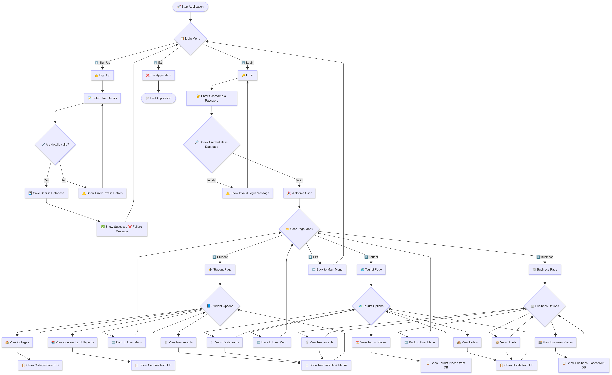

Title: Smart City Guide Application

Description:- This project is a Java-based command-line application designed to act as a Smart City Guide. It provides users with information on various city aspects, including tourist spots, business locations, restaurants, and educational institutions. The application features user registration, login, and a menu-driven interface to navigate different categories. It uses a MySQL database to store and retrieve data about places and users, making the information dynamic and organized. The program also uses ANSI escape codes for colorful and formatted text output, enhancing the user experience.

Working-Flow: 
    The application ensures:
- Secure user registration and login
- Validation of user details
- Role-based navigation
- Database integration for fetching and displaying information

---

## ⚙️ Process Flow

### 1️⃣ Main Menu
- **Sign Up**: Register a new user by providing details.
- **Login**: Authenticate with username and password.
- **Exit**: Close the application.

### 2️⃣ Sign Up Flow
1. User enters personal details.  
2. System validates the details.  
   - ✅ If valid → User saved in database.  
   - ❌ If invalid → Show error message and re-enter details.  
3. Success/Failure message is displayed.  
4. Return to main menu.  

### 3️⃣ Login Flow
1. User enters username & password.  
2. System checks credentials in the database.  
   - ✅ If valid → User is welcomed.  
   - ❌ If invalid → Show invalid login message and retry.  

### 4️⃣ User Page Menu (Post Login)
- **Student Page**  
  - View Colleges  
  - View Courses by College ID  
  - View Restaurants  
- **Tourist Page**  
  - View Tourist Places  
  - View Hotels  
  - View Restaurants  
- **Business Page**  
  - View Business Places  
  - View Hotels  
  - View Restaurants  
- **Exit to Main Menu**

---

Flow Chart:-
    